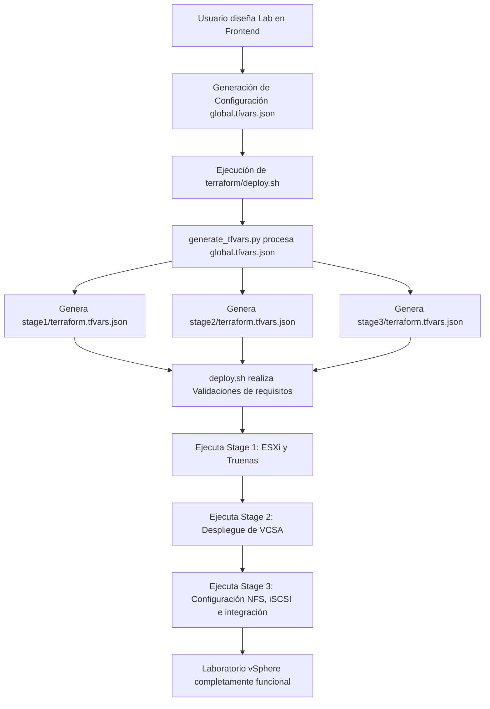

# Wetcom Labs - Despliegue de Laboratorios vSphere

Este proyecto es una solución integral para el diseño, configuración y despliegue automatizado de entornos de laboratorio de VMware vSphere anidados (*nested*). Consta de dos componentes principales:

1. **`frontend/`**: Una interfaz de usuario moderna basada en web que permite configurar de manera visual e intuitiva los recursos, hosts ESXi, vCenter, TrueNAS y servidores Windows para los laboratorios.
2. **`terraform/`**: El motor de infraestructura como código (IaC) estructurado en etapas (*stages*) que se encarga del aprovisionamiento real sobre vCenter, orquestado mediante scripts bash y generadores de variables de configuración.

---

## Estructura General del Proyecto

```text
Wetcom-Labs/
├── frontend/             # Aplicación web de configuración (Next.js)
│   ├── app/              # Rutas y páginas (App Router)
│   ├── components/       # Componentes visuales (UI y formularios)
│   ├── hooks/            # Hooks de React personalizados
│   ├── lib/              # Utilidades y modelos de datos de configuración
│   ├── public/           # Archivos estáticos y recursos multimedia
│   ├── styles/           # Estilos globales y Tailwind CSS
│   ├── package.json      # Dependencias y scripts de ejecución
│   └── tsconfig.json     # Configuración de TypeScript
│
└── terraform/            # Backend de infraestructura (Terraform & Scripts)
    ├── README.md         # Documentación de uso de infraestructura
    ├── deploy.sh         # Script de orquestación y despliegue del pipeline
    ├── generate_tfvars.py# Script Python de mapeo y generación de tfvars
    ├── global.tfvars.json# Configuración global única (Single Source of Truth)
    ├── stage1/           # Infraestructura base (Nested ESXi & Storage)
    ├── stage2/           # Despliegue del vCenter anidado (VCSA)
    └── stage3/           # Configuración de red y almacenamiento de destino
```

---

## Stack Tecnológico: Backend (`terraform/`)

La carpeta `terraform/` contiene la automatización de la infraestructura necesaria para desplegar los entornos virtuales.

### 1. Componentes del Stack
*   **Terraform**: Utilizado para declarar y aprovisionar los recursos de forma declarativa e idempotente.
*   **Bash (Linux)**: Scripting de automatización (`deploy.sh`) que actúa como motor de ejecución y control del pipeline de despliegue.
*   **Python 3**: Scripting de procesamiento de datos (`generate_tfvars.py`) encargado de parsear archivos `.tf` de variables y generar las configuraciones específicas de cada stage.

### 2. Proveedores y Dependencias de Terraform
*   **HashiCorp vSphere Provider**: Proveedor principal de Terraform para interactuar con la API del vCenter físico o principal (*Playground*) para crear las VMs anidadas, redes, folders y resource pools.
*   **Plantilla OVF de ESXi**: Requiere un OVA de ESXi anidado (por ejemplo, `wpc-esxi-8u3-template.ova`) almacenado en el directorio `.templates/` o en `stage1/.templates/`.
*   **Instalador de vCenter (VCSA ISO)**: Requiere el instalador ISO de vCenter extraído localmente (por ejemplo, bajo la ruta `vcsa_iso_extract/`) en el host de ejecución para poder invocar al instalador de CLI (`vcsa-deploy`).

### 3. Etapas de Despliegue (*Stages*)
El aprovisionamiento se separa en tres etapas incrementales para resolver dependencias lógicas:
*   **[Stage 1](file:///home/wpc/Desktop/Wetcom-Labs/terraform/stage1)**: Prepara la infraestructura base física. Despliega las máquinas virtuales que actuarán como hosts ESXi anidados y la máquina de almacenamiento Truenas inicial.
*   **[Stage 2](file:///home/wpc/Desktop/Wetcom-Labs/terraform/stage2)**: Valida y ejecuta el instalador CLI de vCenter Server Appliance (`vcsa-deploy`) para desplegar un vCenter anidado dentro de los hosts ESXi creados en la primera fase.
*   **[Stage 3](file:///home/wpc/Desktop/Wetcom-Labs/terraform/stage3)**: Configura las exportaciones iSCSI y NFS en TrueNAS, registra los hosts ESXi bajo el nuevo vCenter anidado y aprovisiona los datastores compartidos.

---

## Stack Tecnológico: Frontend (`frontend/`)

El frontend proporciona una interfaz web rica, reactiva y adaptada para diseñar las topologías de laboratorio complejas antes de su despliegue.

### 1. Framework y Core
*   **Next.js (v16.2.6)**: Framework de React con soporte para renderizado híbrido y optimización automática. Utiliza la estructura moderna **App Router**.
*   **React (v19)**: Biblioteca de componentes reactivos.
*   **TypeScript (v5.7.3)**: Tipado estático y robustez en la arquitectura de datos del formulario y modelos del laboratorio.

### 2. Estilos y Diseño Visual
*   **Tailwind CSS (v4.2.0)**: Utilizado para el diseño modular, responsivo y ágil mediante clases de utilidad.
*   **Radix UI**: Primitivas de UI accesibles y sin estilos para el backend de los componentes (modales, menús desplegables, accordions, etc.).
*   **Shadcn UI (Estructura)**: Implementación de componentes listos para usar en `components/ui/` utilizando `class-variance-authority` y `tailwind-merge` para facilitar la personalización.
*   **Lucide React**: Conjunto de iconos vectoriales consistentes y modernos.

### 3. Gestión del Estado, Validación y Formularios
*   **React Hook Form (v7.54.1)**: Control del estado del formulario de configuración de laboratorios con óptimo rendimiento de renderizado.
*   **Zod (v3.24.1)**: Validación estricta y tipado en tiempo de ejecución de las configuraciones ingresadas por el usuario.

### 4. Visualización y Utilidades Extra
*   **Recharts (v2.15.0)**: Biblioteca de gráficos basada en componentes React para representar estadísticas o el consumo de recursos de CPU, RAM y almacenamiento configurado.
*   **Date-fns (v4.1.0)**: Procesamiento y formateo de fechas.
*   **Embla Carousel**: Animaciones para sliders de pasos o cards.
*   **Sonner & Vaul**: Manejo intuitivo de notificaciones tipo Toast y paneles deslizantes (*drawers*).

### 5. Gestor de Paquetes
*   **pnpm**: Utilizado como gestor de dependencias ultrarrápido y eficiente con soporte para monorrepositorios (`pnpm-workspace.yaml`).

---

## Flujo de Funcionamiento del Sistema

El flujo completo desde la configuración hasta el aprovisionamiento de la infraestructura funciona de la siguiente manera:



### Detalle del pipeline:
1.  **Fuente Única de Verdad (`global.tfvars.json`)**:
    Toda la información del laboratorio (servidores vCenter físicos, IPs de hosts ESXi, passwords, almacenamiento TrueNAS, etc.) se define centralizadamente en `terraform/global.tfvars.json`.
2.  **Mapeo Inteligente (`generate_tfvars.py`)**:
    El script Python lee `variables.tf` para cada una de las carpetas de `stageX`, identifica qué variables son requeridas para cada paso y extrae selectivamente sus valores correspondientes desde la configuración global usando mapeos estructurados. Esto evita la duplicación de datos entre etapas.
3.  **Ejecución y Tolerancia a Fallos (`deploy.sh`)**:
    *   **Validaciones**: Verifica la existencia de las plantillas OVF locales y las carpetas de instalación de vCenter requeridas en el host antes de comenzar.
    *   **Orquestación**: Automatiza de forma secuencial la secuencia clásica de Terraform (`init` -> `plan` -> `apply --auto-approve`) para cada etapa.
    *   **Reintentos**: Si una etapa falla por latencias de red o timeouts del vCenter físico, el script implementa lógica de reintentos automática (configurada por defecto a 2 intentos con un delay de 30 segundos) limpiando los archivos de estado local dañados para garantizar un despliegue exitoso.
