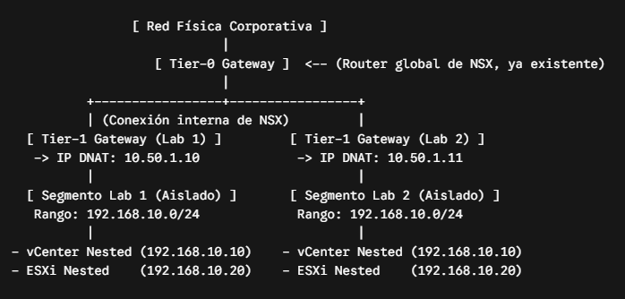

# Wetcom Labs

## Uso
El siguiente paso a paso debe realizarse en una máquina virtual o física en la misma red del vCenter (o con acceso al mismo).

### Instalación de requerimientos
1. [Instalar Chocolatey](https://chocolatey.org/)
2. Instalar Terraform y Packer
```
# Windows
choco install terraform packer git vscode -y

# Linux
sudo apt install terraform packer git
```

### Preparación del entorno
Para que el sistema funcione se deberán ingresar un conjunto de variables (ver ``variables.tf``).

Para asignarle valores, podemos hacerlo por consola o declarando los valores en un archivo.

Para crear el archivo, podemos tomar como ejemplo ``terraform.tfvars.json.example``. Recomendamos copiar el archivo y cambiar el nombre a ``terraform.tfvars.json`` para ingresar los valores propios y no pushearlos por accidente al repositorio.

### Instalación de dependencias de Terraform
Se deeb descargar los binarios del provider de vSphere y configurar el directorio de trabajo local `.terraform` (no se debe pushear al repositorio).
```
terraform init
```

### Ejecución
Primeramente podemos realizar una lectura del estado actual de vSphere, compararlo con el código HCL y mostrar un plan de ejecución determinista sin alterar el entorno.
```
# Para ingresar las variables por línea de comandos
terraform plan

# Para utilizar las variables del archivo terraform.tfvars.json
terraform plan -var-file=terraform.tfvars.json
```

Luego, para consolidar los cambios:
``` 
# Para ingresar las variables por línea de comandos
terraform apply

# Para utilizar las variables del archivo terraform.tfvars.json
terraform apply -var-file=terraform.tfvars.json
```
Luego de ejecutar `terraform apply`, se consolidarán los cambios ejecutando de forma ordenada las llamadas API contra vCenter. También se genera el archivo local terraform.tfstate.
'''

# Documentación Útil

- [vSphere Provider For Terraform](https://registry.terraform.io/providers/hashicorp/vsphere/latest/docs)

# Data NSX

